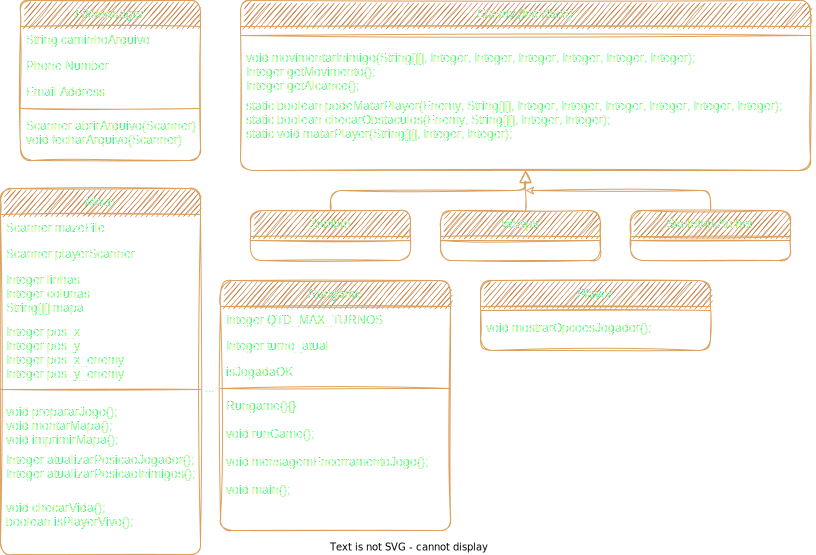

# OnMyWay 

## Disclaimer: este ainda é um README INCOMPLETO.

## Video de apresentação
[Click para ir ao YouTube](https://www.youtube.com "Link para apresentação no youtube")

---

## Descrição
OnMyWay é um jogo singleplayer em turnos que funciona totalmente pelo terminal, maze-like em 2D!

Basicamente, o jogador está encurralado em um mapa-labirinto. Ele pede, com sucesso, por ajuda, mas precisa sobreviver até que ela chegue, evitando inimigos que tentarão mata-lo, onde cada um deles tem seu próprio estilo de comportamento e movimento; o objetivo é simples: sobreviva correndo deles pelo mapa-labirinto por (a definir) segundos (na implementação, são os movimentos do jogador) até que a ajuda (que está... à caminho...) chegue! 

* Ideias abandonadas no meio do caminho que ainda estão presentes no código (quem sabe, um dia...)

    Criar venturas (coisas aleatórios pelo mapa) que podem ser beneficas ou maléficas; todo mundo ama aleatoriedade...

    No inicio do jogo, o jogador sempre começará num lugar aleatório (e os inimigos também), e perde se um dos inimigos entrar em contato com o mesmo. Todas as unidades colidem com os "muros".

    Criar um sistema de "vidas-extra" e uma opcão "dificuldade" (spawn rate/movimento) dos inimigos.

    Fazer uma versão murada onde, quando a ajuda chegar, quebra-se (aos poucos) as muralhas p/ o jogador sair do mapa

---

## Propósito
Este é um projeto feito com dois objetivos:
- Pontuar como a atividade final da disciplina de LP2 (imd0040);
- Se divertir (porquê não, não é mesmo?)

---

## Participantes
Andreon Souza de Medeiros

---

## Diagrama de classes

---

## Como realizar o build

Obs: é necessário ter o Gradle instalado para realizar o build

Com o Gradle instalado no seu sistema, após clonar o projeto para seu ambiente local, abra uma janela terminal/console na pasta do projeto local e digite:

`gradle clean build`

---

## Como executar e pre-requisitos

* Versão 1:
Para executar via linha de comando em um terminal, é preciso ter um JRE instalado na sua máquina (preferencialmente Java 8+). Basta abrir o console na pasta do projeto e, após realizar o build, digite:

    `./gradlew run`

* Versão 2:
Abra o projeto em qualquer IDE com suporte ao Java (Eclipse, Netbeans, VSCode com as extensões necessárias) e execute-o diretamente lá.
